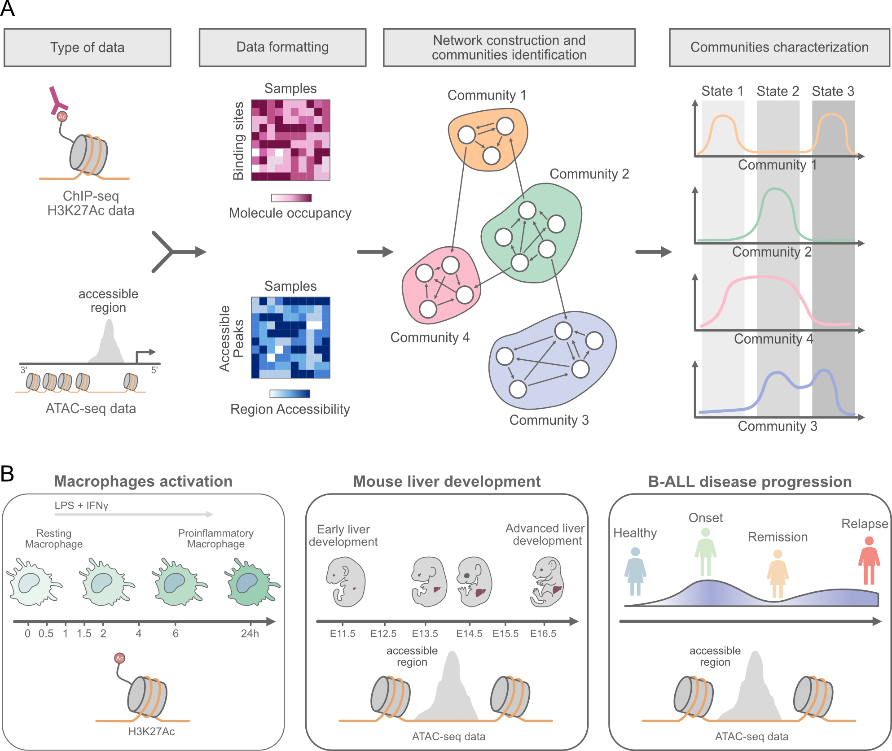

# T-ChroNet (**T**ime-aware **Chro**matin **Net**work)

## Abstract
Networks are widely applied to investigate relationships among individual components of complex biological systems. Recent application of biological networks, such as gene co-expression networks and gene regulatory networks, has been instrumental to define principles of transcriptional modulation in development and disease. However, computational methods that can embed the activity of cis-regulatory elements (CRE) into a network are still limited. Capturing temporal CRE activity within a network could help revealing regulatory programs involved in cell fate commitment and disease development. To address this, we present T-ChroNet (Time-aware Chromatin Network), a network-based method that models CRE as nodes and their temporal co-accessibility as edges. Through the detection of CRE sharing similar accessibility patterns over time, T-ChroNet allows the inference of putative upstream regulators and downstream biological pathways. We applied T-ChroNet to temporally-resolved CRE datasets, from both human and mouse, including chromatin accessibility (ATAC-seq) and histone post-translational modifications (H3K27ac ChIP-seq). T-ChroNet successfully recovered known regulators and enriched pathways for both modalities and species, while also uncovering novel putative factors and mechanisms regulating cell identity, organ development and disease progression.


## Install
To install TChronetPy:
```
cd ~
git clone https://github.com/DGStefano/T-ChroNet.git
cd ~/T-ChroNet
conda env create -f environment.yml
conda activate tchronet_env
pip install git+https://github.com/DGStefano/T-ChroNet.git#subdirectory=TChroNetPy
```
To install TChronetR, ensure you have the necessary Bioconductor dependencies first:
```
# Install Bioconductor dependencies
if (!require("BiocManager", quietly = TRUE))
    install.packages("BiocManager")

BiocManager::install(c("Matrix", "SummarizedExperiment", "S4Vectors", "rtracklayer", "rGREAT", "monaLisa", "IRanges", "GenomicRanges", "GenomeInfoDb", "BSgenome", "Biostrings", "BiocParallel", "BiocGenerics"))

# Install visualization and utility dependencies
install.packages("remotes")
remotes::install_github("davidsjoberg/ggsankey")

# Install T-ChroNet from the subdirectory
remotes::install_github("DGStefano/T-ChroNet", subdir = "TChroNetR")
```

## Tutorial

This short tutorial explains how to run **T-ChroNet** using the included **toy dataset** composed of only chromosome 1 from the THP-1 dataset.

1. Run tchronet tool to evalute correlation parameters among all the peaks: 
```
conda activate tchronet_env
tchronetpy -m ~/T-ChroNet/toy_data/data/thp1_test.tsv -o ~/T-ChroNet/toy_data/results/th/ -@ 2  --min_t_type pval --min_t_val 0.1
```
2. Use TChronetR for netowrk analysis
The full TChronetR vignette is avaliable [html](https://htmlpreview.github.io/?https://github.com/DGStefano/T-ChroNet/blob/main/TChroNetR/vignettes/TchronetR_Vignette.html) [rmd](./TChroNetR/vignettes/TchronetR_Vignette.Rmd)


## Execution
To run the tchronet tool, there are some positional arguments to be set :
- -m or --matrix : [Required] Path to input matrix
- -o or --output : [Required] Path to the output file
- -s or --stepsize : Stepsize for RAM parameters
- -@ or --threads : Number of threads to use
- --min_t_type : Selection criteria for filtering results: 'pval' for significance testing or 'cor' for correlation coefficient strength
- --max_t_val : Maximum correlation threshold (end of last interval)
- --min_t_val : Numerical threshold limit. Results exceeding this value (for pval) or falling below it (for cor) will be filtered out.

[](https://doi.org/10.5281/zenodo.16737392)